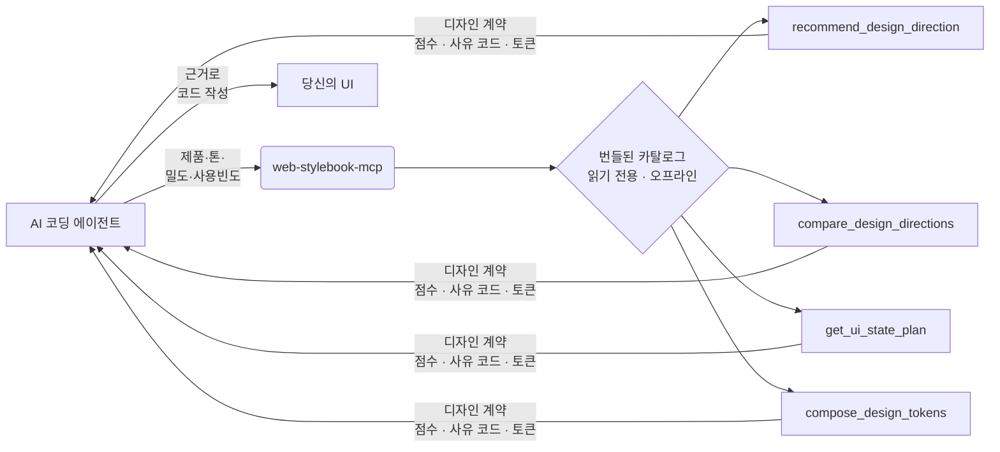

<div align="center">

# web-stylebook-mcp

**AI 코딩 에이전트를 위한 디자인 인텔리전스.** 매번 똑같은 히어로 + 카드 3개는 그만.
에이전트가 점수화된 디자인 *계약*(방향·UI 상태 계획·토큰)을 받아, 근거를 바탕으로 코드를 씁니다.

[](https://www.npmjs.com/package/web-stylebook-mcp)
[](https://www.npmjs.com/package/web-stylebook-mcp)
[](./LICENSE)
[](https://nodejs.org)
[](https://modelcontextprotocol.io)

[English](./README.md) · **한국어**

</div>

---

코딩 에이전트는 *무엇이 어떻게 생겨야 하는지*를 정하지 못해서 매번 똑같은 UI로 도망칩니다 — 히어로 + 카드 3개 + 그라데이션. `web-stylebook-mcp`는 에이전트에게 **디자인 계약**(점수화된 시각 방향, UI 상태 계획, 디자인 토큰)을 건네는 Model Context Protocol 서버이고, [webstylebook.com](https://webstylebook.com)과 동일한 큐레이션 카탈로그에서 가져옵니다. **코드가 아니라 근거**를 돌려줍니다. 코드는 여전히 에이전트가 쓰지만, 이제 무엇을 만들지 알고 씁니다.

API 키 없음. 모델 호출 없음. 네트워크 없음. 파일시스템 접근 없음. **결정적이고, 읽기 전용이며, 완전히 로컬.**

## 없을 때 / 있을 때

| | `web-stylebook-mcp` 없이 | `web-stylebook-mcp`로 |
|---|---|---|
| **방향** | 한 가지 룩을 찍어서 밀어붙임 | 점수화된 후보 + 사유 코드 + *무엇을 왜 탈락*시켰는지 |
| **UI 상태** | 해피패스만, 빈/에러/로딩은 나중에 덧붙임 | 표면별 필수/권장/도메인 상태를 처음부터 |
| **토큰** | 손으로 고른 hex, 대비는 거의 미확인 | 역할 기반 토큰 + WCAG 대비 경고 |
| **결과** | 천편일률 AI UI | 에이전트가 근거로 삼아 구현하는 디자인 계약 |

## 직접 판단하는 걸 보세요

> *"SRE용 고밀도 모니터링 대시보드. 온콜로 하루 종일 본다. 차분하고 기술적으로. 사이버펑크는 피해서."*

```jsonc
// → recommend_design_direction  (입력)
{
  "productDescription": "High-density monitoring dashboard for SREs, watched all day on call",
  "productType": "operational-saas",
  "tone": ["calm", "technical"],
  "density": "high",
  "usageFrequency": "daily",
  "avoid": ["cyberpunk"]
}
```

```jsonc
// ← 결과
{
  "confidence": "high",
  "candidates": [                      // 모두 0.91 동점 — 순서는 의미 없음
    { "style": "notion-style",   "score": 0.91 },
    { "style": "platform-core",  "score": 0.91 },
    { "style": "quiet-utility",  "score": 0.91 },
    { "style": "runtime-signal", "score": 0.91 }
  ],
  "rejected": [
    { "style": "cyberpunk-glitch", "reasons": ["EXPLICITLY_AVOIDED", "DAILY_USE_OVERSTIMULATION"] },
    { "style": "aurora-gradient",  "reasons": ["PRODUCT_NOT_IDEAL", "DAILY_USE_OVERSTIMULATION"] }
  ],
  "pairing": "macos-liquid-glass + notion-style (조용한 폼 / 내비)",
  "guidance": "Treat candidates as scored evidence; pick by product context. 4 are tied — ordering isn't meaningful; use differentiators."
}
```

여기서 *하지 않는* 것에 주목하세요 — 정답 하나를 내세우지 않습니다. 네 방향이 0.91로 동점이고, 탈락에는 사유 코드가 붙고, 가이던스는 최종 선택을 모델에게 넘깁니다. 그 정직함이 핵심입니다. 서버는 근거를 주고, 결정은 에이전트가 합니다.

그다음 고른 방향을 실제 토큰으로:

```jsonc
// → compose_design_tokens(style: "notion-style", format: "css-variables", theme: "light")
// WCAG 대비 경고 0건
:root {
  --color-canvas: #ffffff;
  --color-text:   #37352f;
  --color-accent: #2383e2;
  --color-border: #d3d3d1;
  /* … 역할 기반 색·타이포·간격·radius·모션·밀도 */
}
```

요청 한 번에 — 에이전트는 방향을 고르고, 무엇이 왜 탈락했는지 보고, WCAG를 통과하는 토큰까지 받았습니다. 코드 한 줄 생성하지 않고.

## 동작 방식



에이전트가 제품을 설명하면, 서버가 큐레이션 카탈로그를 점수화해 구조화된 근거를 돌려줍니다. 코드는 생성하지 않고, 어떤 것도 기기를 벗어나지 않습니다.

## 설치

**Node 20 이상** 필요.

<details open>
<summary><b>Codex CLI · IDE 확장</b></summary>

Codex CLI로 추가:

```bash
codex mcp add web-stylebook -- npx -y web-stylebook-mcp@latest
```

또는 `~/.codex/config.toml`에 추가하세요. 신뢰한 저장소에서는 프로젝트 범위
`.codex/config.toml`도 사용할 수 있습니다:

```toml
[mcp_servers.web-stylebook]
command = "npx"
args = ["-y", "web-stylebook-mcp@latest"]
```

설정을 편집한 뒤 Codex를 재시작하거나 새 세션을 여세요. Codex TUI에서는 `/mcp`로
서버 활성 상태를 확인할 수 있습니다.

</details>

<details>
<summary><b>Claude Code</b></summary>

```bash
claude mcp add web-stylebook -- npx -y web-stylebook-mcp@latest
```

</details>

<details>
<summary><b>Cursor · Windsurf · 일반 MCP 클라이언트</b></summary>

MCP 설정에 추가:

```json
{
  "mcpServers": {
    "web-stylebook": {
      "command": "npx",
      "args": ["-y", "web-stylebook-mcp@latest"]
    }
  }
}
```

</details>

<details>
<summary><b>Claude Desktop</b></summary>

같은 블록을 `claude_desktop_config.json`에 추가하고 재시작:

- **macOS:** `~/Library/Application Support/Claude/claude_desktop_config.json`
- **Windows:** `%APPDATA%\Claude\claude_desktop_config.json`

```json
{
  "mcpServers": {
    "web-stylebook": {
      "command": "npx",
      "args": ["-y", "web-stylebook-mcp@latest"]
    }
  }
}
```

</details>

## 툴

| 툴 | 받는 것 | 정직한 점 |
|------|--------------|-----------------|
| **`recommend_design_direction`** | 사유 코드가 붙은 점수화 스타일 후보, *이유*가 붙은 **탈락** 스타일, 보조 페어링, 신뢰도 | 최종 선택은 모델이 — 이건 근거 제공자입니다 |
| **`compare_design_directions`** | 2~4개 방향을 제품 적합성·반복 사용·밀도·신뢰·차별성·접근성 리스크·모션·유지보수로 비교 | 정답 하나를 선언하지 않습니다 |
| **`get_ui_state_plan`** | 표면(데이터 테이블·폼·체크아웃·채팅·개발자 콘솔)의 필수/권장/도메인 UI 상태 — 트리거·표시 필수·금지·접근성·모션 | 에이전트가 잊는 상태까지: 빈·에러·로딩·엣지 |
| **`compose_design_tokens`** | 역할 기반 토큰(색·타이포·간격·radius·모션·밀도)을 `json` / `css-variables` / `tailwind` / `typescript`, light / dark / both | WCAG 대비 경고를 숨기지 않고 내보냅니다 |

**카탈로그:** 스타일 48 · 컴포넌트 20 · 표면 5 · UI 상태 레시피 57 · 모션 프로파일 29 · 제품 아키타입 14.

## 다국어 출력

모든 툴은 선택적 `locale`을 받습니다. 사유 코드·가이던스·라벨이 요청한 언어로 돌아옵니다:

```text
"en" | "ko" | "ja"     // English · 한국어 · 日本語
```

## 리소스

카탈로그를 MCP 리소스로 직접 탐색:

```
webstylebook://manifest
webstylebook://styles · /styles/{id}
webstylebook://motion · /motion/{id}
webstylebook://components · /components/{id}
webstylebook://states/surfaces · /states/{surface} · /states/{surface}/{state}
webstylebook://products · /products/{id}
webstylebook://policies/anti-patterns · /policies/verification
```

## 프롬프트

자주 쓰는 워크플로우용 MCP 프롬프트:

`design-product` · `design-screen` · `complete-ui-states` · `redesign-with-style` · `audit-design-direction`

## CLI

```bash
web-stylebook-mcp                 # stdio로 서버 실행 (기본)
web-stylebook-mcp --version
web-stylebook-mcp --catalog-info
web-stylebook-mcp --validate-catalog
```

## 동반 스킬

[`skill/`](./skill)에 동반 스킬이 함께 들어있어, 에이전트가 적절한 순간에 이 툴들을 꺼내 쓰고 결과를 제대로 활용하게 합니다(색만 바꾸지 말 것, 후보를 여러 개 제시할 것, 신뢰는 지어내지 말 것, 재사용 컴포넌트로 떨어뜨릴 것):

**Codex**

- `skill/web-stylebook-design/`를 저장소의 `.agents/skills/web-stylebook-design/` 또는
  사용자 범위 `~/.agents/skills/web-stylebook-design/` 같은 Codex 스킬 위치로 복사하거나
  심볼릭 링크하세요.
- 스킬을 설치하지 않을 경우 `skill/AGENTS.md`를 프로젝트의 `AGENTS.md`에 복사하세요.

**Claude Code 및 기타 에이전트**

- 에이전트의 스킬 디렉터리를 `skill/web-stylebook-design/`로 지정하거나,
- `skill/CLAUDE.md`를 프로젝트의 `CLAUDE.md` 또는 해당 에이전트의 rules 파일에 복사하세요.

## 프라이버시 · 보안

| 항목 | |
|----------|---|
| API 키 | 없음 |
| 모델 호출 | 없음 |
| 네트워크 접근 | 없음 — 완전 오프라인 동작 |
| 프로젝트 / 파일시스템 접근 | 없음 |
| 동작 | 결정적, 읽기 전용 |

서버는 패키지에 번들된 카탈로그 스냅샷만 읽습니다. 어디로도 전송하지 않으며, 같은 입력은 항상 같은 계약을 냅니다.

## 호환성

- **Node:** 20 이상
- **전송:** stdio (Model Context Protocol)
- **클라이언트:** Codex CLI / IDE 확장 · Claude Code · Claude Desktop · Cursor · Windsurf, 그리고 모든 MCP 호환 클라이언트

## 라이선스

[MIT](./LICENSE) — 코드 **및** 번들된 카탈로그 스냅샷에 적용 (상업적 사용 자유).

> [webstylebook.com](https://webstylebook.com) 웹사이트는 CC BY-NC로 배포됩니다. 동일한 저작권자가 이 패키지에 번들된 카탈로그 스냅샷에 대해 MIT를 부여합니다.
