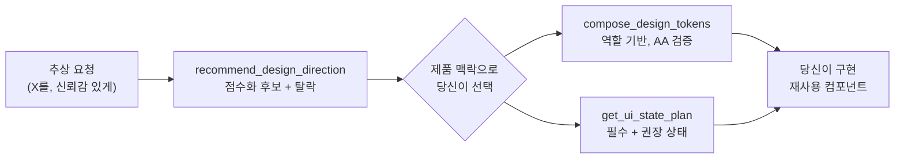

<div align="center">

# web-stylebook-mcp

**코딩 에이전트를 위한 디자인 인텔리전스.**
제품에 맞는 시각 방향을 고르고, 화면이 실제로 필요한 UI 상태를 빠짐없이 다루고, 디자인 토큰을
구성합니다 — 에이전트가 천편일률적인 "AI 티 나는" UI를 그만 찍어내도록.

[](https://www.npmjs.com/package/web-stylebook-mcp)
[](https://www.npmjs.com/package/web-stylebook-mcp)
[](./LICENSE)
[](https://nodejs.org)
[](https://modelcontextprotocol.io)

[English](README.md) · [**한국어**](README.ko.md)

</div>

---

코딩 에이전트는 UI 코드는 잘 짜지만 *그게 어떻게 생겨야 하는지*를 정하는 데는 약합니다. 그래서
매번 똑같은 히어로 + 카드 3개 + 그라데이션으로 도망치죠. **web-stylebook-mcp**는 에이전트에게
디자인 판단의 근거를 줍니다 — 점수화된 시각 방향, 화면에 실제로 필요한 UI 상태, 접근성 토큰을
**코드가 아니라 계약(contract)으로** 돌려줍니다. 코드는 여전히 에이전트가 쓰지만, 습관이 아니라
근거에서 출발합니다.

- **API 키·모델 호출·네트워크·프로젝트 접근 일절 없음.** 결정적(deterministic)이고 읽기 전용인 디자인 지식을 로컬에 패키징.
- [Web Stylebook](https://webstylebook.com)과 동일한 카탈로그 — 스타일 48 · 컴포넌트 20 · 표면 5 · 상태 레시피 57.
- **출력 언어: English · 한국어 · 日本語.**

## 빠른 시작

MCP 클라이언트에 등록하고(클라이언트별 방법은 [설치](#설치) 참고) 그냥 요청하세요:

```json
{ "mcpServers": { "web-stylebook": { "command": "npx", "args": ["-y", "web-stylebook-mcp@latest"] } } }
```

> *"환자 진료 예약 포털을 만들어줘. 신뢰감 있게."*

에이전트가 아래 툴을 호출해 방향을 함께 고르고, 실제 디자인 계약을 바탕으로 구현합니다.

## 동작 방식



MCP는 **지식**(결정적·모델 비의존)을, 에이전트는 **판단과 코드**를 담당합니다. 둘을 이어주는 건
동반 스킬입니다.

## 설치

<details open>
<summary><b>Claude Code</b></summary>

```bash
claude mcp add web-stylebook -- npx -y web-stylebook-mcp@latest
```
</details>

<details>
<summary><b>Cursor · Windsurf · 일반 MCP 클라이언트</b></summary>

클라이언트의 MCP 설정에 추가:
```json
{ "mcpServers": { "web-stylebook": { "command": "npx", "args": ["-y", "web-stylebook-mcp@latest"] } } }
```
</details>

<details>
<summary><b>Claude Desktop</b></summary>

설정 파일을 수정한 뒤 Claude Desktop을 재시작:
- macOS: `~/Library/Application Support/Claude/claude_desktop_config.json`
- Windows: `%APPDATA%\Claude\claude_desktop_config.json`

```json
{ "mcpServers": { "web-stylebook": { "command": "npx", "args": ["-y", "web-stylebook-mcp@latest"] } } }
```
</details>

## 동반 스킬

패키지는 트리거·사용 규칙을 `skill/`에 함께 담고 있습니다:

- **Claude Code / 스킬 지원 호스트:** 스킬 디렉터리를 `skill/web-stylebook-design/`로 지정.
- **그 외 호스트:** `skill/CLAUDE.md`의 블록을 프로젝트의 `CLAUDE.md`(또는 룰 파일)에 복사.

이 스킬은 *언제* 툴을 호출하고 결과를 *어떻게* 쓰는지를 규정합니다 — 색만 바꾸지 말고 새로 구성할
것, 완성된 후보를 여러 개 제시할 것, 신뢰는 지어내지 말고 근거로 만들 것, 상태는 컴포넌트가 소유할
것, 최종 산출은 재사용 컴포넌트로 떨어뜨릴 것.

## 툴

| 툴 | 하는 일 |
|---|---|
| `recommend_design_direction` | 점수화된 스타일 후보 + 사유 코드 + 탈락 스타일과 이유 + 보조 페어링 + 신뢰도. 근거 제공자 역할이며 **최종 선택은 모델(당신)이** 합니다. |
| `compare_design_directions` | 2~4개 방향을 제품 적합성·반복 사용·밀도·신뢰·차별성·접근성 리스크·모션·유지보수로 비교. 정답 하나를 강요하지 않고 맥락으로 고르게 합니다. |
| `get_ui_state_plan` | 표면(데이터 테이블·폼·체크아웃·채팅·개발자 콘솔)의 필수/권장/도메인 상태를 트리거·표시 필수·금지 사항·접근성·모션과 함께 제공. |
| `compose_design_tokens` | 역할 기반 디자인 토큰(색·타이포·간격·radius·모션·밀도)을 json / css‑variables / tailwind / typescript로, light/dark/both, WCAG 대비 경고 포함. |

검색·브리프 작성·화면 설계·"언제 호출할지" 트리거 같은 산문형 작업은 추가 툴이 아니라 동반
**스킬**이 담당합니다.

## 다국어 출력

모든 툴은 선택적 `locale`을 받습니다 — `en`(기본) · `ko` · `ja`. 가이던스·근거와 현지화된 카탈로그
텍스트가 해당 언어로 돌아옵니다:

```json
{
  "productDescription": "환자 진료 예약 포털",
  "tone": ["trustworthy", "calm"],
  "trustSensitivity": "high",
  "locale": "ko"
}
```

## 리소스

`webstylebook://manifest` · `…/styles` · `…/styles/{id}` · `…/motion` · `…/motion/{id}`
· `…/components` · `…/components/{id}` · `…/states/surfaces` · `…/states/{surface}`
· `…/states/{surface}/{state}` · `…/products` · `…/products/{id}`
· `…/policies/anti-patterns` · `…/policies/verification`

## 프롬프트

`design-product` · `design-screen` · `complete-ui-states` · `redesign-with-style` · `audit-design-direction`

## CLI

```bash
web-stylebook-mcp                  # stdio로 MCP 서버 시작 (기본)
web-stylebook-mcp --version
web-stylebook-mcp --catalog-info   # 카탈로그 매니페스트 출력 (버전·해시·개수)
web-stylebook-mcp --validate-catalog
```

## 예시

> SRE용 고밀도 모니터링 대시보드를 디자인해줘. 매일 쓰고, 차분하고 기술적으로. 사이버펑크 장식은 빼고.

`recommend_design_direction`은 `quiet-utility`·`platform-core`·`runtime-signal` 같은 차분한 운영용
스타일을 후보로 올리고, `cyberpunk-glitch`는 (`EXPLICITLY_AVOIDED`로) **탈락**시키며, 조용한 폼·
내비용 보조 페어링을 제안하고 가정과 신뢰도를 기록합니다. 이후 에이전트가 선택한 스타일 리소스를
읽고, `get_ui_state_plan`으로 데이터 테이블 상태를 설계하고, `compose_design_tokens`로 시작 토큰
세트를 만들어 냅니다.

## 프라이버시 · 보안

v0.1은 이 모듈에 패키징된 불변 카탈로그만 읽습니다. 파일시스템·git·환경변수·셸·브라우저·네트워크·
모델 API에 일절 접근하지 않습니다. 출력은 입력의 결정적 함수라, 같은 요청은 항상 같은 결과를 냅니다.

## 호환성

- Node 20 이상
- `@modelcontextprotocol/sdk` 1.x 기반 (stdio 전송)

## 라이선스

MIT — 코드와 번들된 카탈로그 스냅샷 모두에 적용됩니다. 카탈로그 데이터를 포함해 자유롭게, 상업적으로
사용할 수 있습니다.

> [Web Stylebook](https://webstylebook.com) 웹사이트 자체는 별도로 CC BY‑NC로 배포됩니다. 이
> 패키지의 MIT 허가는 동일한 저작권자가 여기 포함된 카탈로그 스냅샷에 대해 부여한 것입니다.
