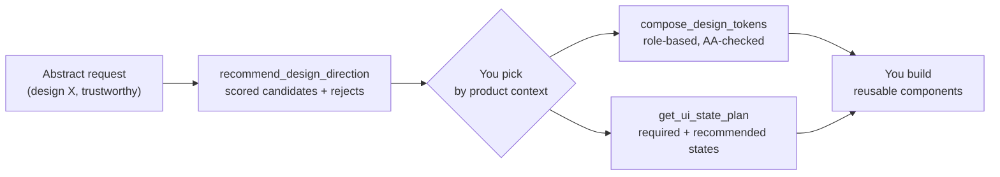

<div align="center">

# web-stylebook-mcp

**Design intelligence for coding agents.**
Pick a product‑fit visual direction, cover the real UI states, and compose design tokens —
so your agent stops shipping generic, AI‑looking interfaces.

[](https://www.npmjs.com/package/web-stylebook-mcp)
[](https://www.npmjs.com/package/web-stylebook-mcp)
[](./LICENSE)
[](https://nodejs.org)
[](https://modelcontextprotocol.io)

[**English**](README.md) · [한국어](README.ko.md)

</div>

---

Coding agents are great at writing UI code and bad at *deciding what it should look like* — so
they reach for the same hero + three cards + gradient every time. **web-stylebook-mcp** gives the
agent a design brain: it returns scored visual directions, the UI states a surface actually needs,
and accessible design tokens — as **contracts, not code**. Your agent still writes the code, but now
from evidence instead of habit.

- **No API key. No model call. No network. No project access.** Deterministic, read‑only design knowledge, packaged locally.
- Built on the same catalog as [Web Stylebook](https://webstylebook.com) — 48 styles, 20 components, 5 surfaces, 57 state recipes.
- **Output localized in English · 한국어 · 日本語.**

## Quickstart

Add it to your MCP client (see [Install](#install) for per‑client steps), then just ask:

```json
{ "mcpServers": { "web-stylebook": { "command": "npx", "args": ["-y", "web-stylebook-mcp@latest"] } } }
```

> *"Design a patient booking portal. Make it trustworthy."*

The agent calls the tools below, picks a direction with you, and builds from real design contracts.

## How it works



The MCP supplies the **knowledge** (deterministic, model‑free). The agent supplies the **judgment and
the code**. The companion skill wires the two together.

## Install

<details open>
<summary><b>Claude Code</b></summary>

```bash
claude mcp add web-stylebook -- npx -y web-stylebook-mcp@latest
```
</details>

<details>
<summary><b>Cursor · Windsurf · generic MCP client</b></summary>

Add to the client's MCP config:
```json
{ "mcpServers": { "web-stylebook": { "command": "npx", "args": ["-y", "web-stylebook-mcp@latest"] } } }
```
</details>

<details>
<summary><b>Claude Desktop</b></summary>

Edit the config file, then restart Claude Desktop:
- macOS: `~/Library/Application Support/Claude/claude_desktop_config.json`
- Windows: `%APPDATA%\Claude\claude_desktop_config.json`

```json
{ "mcpServers": { "web-stylebook": { "command": "npx", "args": ["-y", "web-stylebook-mcp@latest"] } } }
```
</details>

## Companion skill

The package ships the trigger + usage logic in `skill/`:

- **Claude Code / skill‑aware hosts:** point your skills directory at `skill/web-stylebook-design/`.
- **Other hosts:** copy the block in `skill/CLAUDE.md` into your project's `CLAUDE.md` (or rules file).

It encodes *when* to call these tools and how to use the results — compose, don't recolor; offer
multiple fully‑composed candidates; earn trust, don't fake it; component‑owned states; land on
reusable components.

## Tools

| Tool | What it does |
|---|---|
| `recommend_design_direction` | Scored style candidates + reason codes + rejected styles with reasons + secondary pairings + confidence. Evidence‑provider: **your model makes the final pick.** |
| `compare_design_directions` | Compares 2–4 directions across product fit, repeated‑use, density, trust, distinctiveness, accessibility risk, motion and maintenance. No single winner — choose by fit. |
| `get_ui_state_plan` | Required / recommended / domain‑specific UI states for a surface (data‑table, form, checkout, chat, developer‑console) with triggers, must‑show, must‑not, a11y and motion. |
| `compose_design_tokens` | Role‑based design tokens (color, type, spacing, radius, motion, density) in json / css‑variables / tailwind / typescript, light/dark/both, with WCAG contrast warnings. |

Prose‑shaped work (search, brief composition, screen planning, the "when to call" trigger) is
carried by the companion **skill**, not by extra tools.

## Localized output

Every tool takes an optional `locale` — `en` (default), `ko`, or `ja`. Guidance, rationale, and
localized catalog text come back in that language:

```json
{
  "productDescription": "환자 진료 예약 포털",
  "tone": ["trustworthy", "calm"],
  "trustSensitivity": "high",
  "locale": "ko"
}
```

## Resources

`webstylebook://manifest` · `…/styles` · `…/styles/{id}` · `…/motion` · `…/motion/{id}`
· `…/components` · `…/components/{id}` · `…/states/surfaces` · `…/states/{surface}`
· `…/states/{surface}/{state}` · `…/products` · `…/products/{id}`
· `…/policies/anti-patterns` · `…/policies/verification`

## Prompts

`design-product` · `design-screen` · `complete-ui-states` · `redesign-with-style` · `audit-design-direction`

## CLI

```bash
web-stylebook-mcp                  # start the MCP server over stdio (default)
web-stylebook-mcp --version
web-stylebook-mcp --catalog-info   # print catalog manifest (version, hash, counts)
web-stylebook-mcp --validate-catalog
```

## Example

> Design a high‑density monitoring dashboard for SREs. Used daily. Keep it calm and technical. Avoid cyberpunk decoration.

`recommend_design_direction` surfaces calm operational styles like `quiet-utility`, `platform-core`
and `runtime-signal`, **rejects** `cyberpunk-glitch` (`EXPLICITLY_AVOIDED`), suggests a secondary
pairing for quieter forms/nav, and records its assumptions and confidence. The agent then reads the
chosen style resources, plans the data‑table states with `get_ui_state_plan`, and emits a starting
token set with `compose_design_tokens`.

## Privacy & security

v0.1 reads only the immutable catalog packaged with this module. It does not touch your filesystem,
git, environment, shell, browser, network, or any model API. Output is a deterministic function of
the input — the same request always yields the same result.

## Compatibility

- Node ≥ 20
- Built on `@modelcontextprotocol/sdk` 1.x (stdio transport)

## License

MIT — covers both the code and the bundled catalog snapshot. Use this package, including its catalog
data, freely and commercially.

> The [Web Stylebook](https://webstylebook.com) website is separately licensed CC BY‑NC; this
> package's MIT grant is provided by the same copyright holder for the catalog snapshot shipped here.
