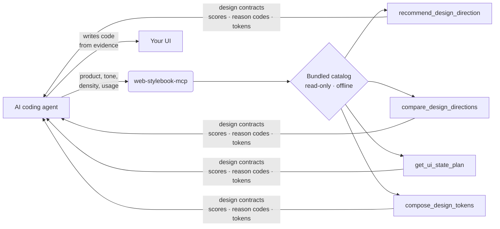

<div align="center">

# web-stylebook-mcp

**Design intelligence for AI coding agents.** Stop shipping the same hero-plus-three-cards.
Your agent gets scored design *contracts* — directions, UI-state plans, tokens — then writes the code from evidence.

[](https://www.npmjs.com/package/web-stylebook-mcp)
[](https://www.npmjs.com/package/web-stylebook-mcp)
[](./LICENSE)
[](https://nodejs.org)
[](https://modelcontextprotocol.io)

**English** · [한국어](./README.ko.md)

</div>

---

Coding agents default to the same generic UI because they can't *decide* what it should look like — so they fall back to hero + 3 cards + a gradient. `web-stylebook-mcp` is a Model Context Protocol server that hands the agent **design contracts** — scored visual directions, UI-state plans, and design tokens — drawn from the same curated catalog as [webstylebook.com](https://webstylebook.com). It returns **evidence, not code**. Your agent still writes the code — now it knows what to build.

No API key. No model call. No network. No filesystem access. **Deterministic, read-only, fully local.**

## Without it / with it

| | Without `web-stylebook-mcp` | With `web-stylebook-mcp` |
|---|---|---|
| **Direction** | Guesses one look, commits to it | Scored candidates + reason codes + what it *rejected* and why |
| **UI states** | Happy path only; empty / error / loading bolted on later | Required / recommended / domain states up front, per surface |
| **Tokens** | Hand-picked hexes, contrast rarely checked | Role-based tokens with WCAG contrast warnings |
| **Result** | Generic AI UI | A defensible design contract the agent builds from |

## Watch it decide

> *"High-density monitoring dashboard for SREs, watched all day on call. Calm, technical. Avoid cyberpunk."*

```jsonc
// → recommend_design_direction  (input)
{
  "productDescription": "High-density monitoring dashboard for SREs, watched all day on call",
  "productType": "operational-saas",
  "tone": ["calm", "technical"],
  "density": "high",
  "usageFrequency": "daily",
  "avoid": ["cyberpunk"]
}
```

```jsonc
// ← result
{
  "confidence": "high",
  "candidates": [                      // all tied at 0.91 — ordering is NOT meaningful
    { "style": "notion-style",   "score": 0.91 },
    { "style": "platform-core",  "score": 0.91 },
    { "style": "quiet-utility",  "score": 0.91 },
    { "style": "runtime-signal", "score": 0.91 }
  ],
  "rejected": [
    { "style": "cyberpunk-glitch", "reasons": ["EXPLICITLY_AVOIDED", "DAILY_USE_OVERSTIMULATION"] },
    { "style": "aurora-gradient",  "reasons": ["PRODUCT_NOT_IDEAL", "DAILY_USE_OVERSTIMULATION"] }
  ],
  "pairing": "macos-liquid-glass + notion-style (quieter forms / nav)",
  "guidance": "Treat candidates as scored evidence; pick by product context. 4 are tied — ordering isn't meaningful; use differentiators."
}
```

Notice what it *doesn't* do: it doesn't pretend there's one winner. Four directions tie at 0.91, the rejects come with reason codes, and the guidance tells the model to make the final call. That honesty is the point — the server provides evidence, the agent decides.

Then turn the chosen direction into real tokens:

```jsonc
// → compose_design_tokens(style: "notion-style", format: "css-variables", theme: "light")
// 0 WCAG contrast warnings
:root {
  --color-canvas: #ffffff;
  --color-text:   #37352f;
  --color-accent: #2383e2;
  --color-border: #d3d3d1;
  /* … role-based color, type, spacing, radius, motion, density */
}
```

One request in — and the agent chose a direction, saw what was rejected and why, and got tokens that pass WCAG, without generating a line of code.

## What an agent builds with it

A different brief — *"a marketing landing page for **Throughline**, a B2B SaaS that turns scattered customer feedback (support tickets, sales calls, app reviews, Slack) into one prioritized roadmap."* No layout, no hero, no styling was specified. Following the companion skill, the agent composed the opening **from the product's core idea** instead of reaching for a stock hero: the right half is a bespoke diagram of the product's actual mechanic — feedback sources converging into an auto-ranked roadmap — not a decorative card you could paste onto any other site.

<div align="center">

</div>

<div align="center"><sub>Composed by an AI agent following the companion skill — the prompt described the product and stack, nothing about the layout.</sub></div>

## How it works



The agent describes the product; the server scores its curated catalog and returns structured evidence. No code is generated and nothing leaves your machine.

## Install

Requires **Node ≥ 20**.

<details open>
<summary><b>Codex CLI · IDE extension</b></summary>

Use the Codex CLI:

```bash
codex mcp add web-stylebook -- npx -y web-stylebook-mcp@latest
```

Or add it to `~/.codex/config.toml`. You can also use a project-scoped
`.codex/config.toml` in a trusted repository:

```toml
[mcp_servers.web-stylebook]
command = "npx"
args = ["-y", "web-stylebook-mcp@latest"]
```

Restart Codex or open a new session after editing config. In the Codex TUI, run `/mcp`
to confirm the server is active.

</details>

<details>
<summary><b>Claude Code</b></summary>

```bash
claude mcp add web-stylebook -- npx -y web-stylebook-mcp@latest
```

</details>

<details>
<summary><b>Cursor · Windsurf · generic MCP client</b></summary>

Add to your MCP config:

```json
{
  "mcpServers": {
    "web-stylebook": {
      "command": "npx",
      "args": ["-y", "web-stylebook-mcp@latest"]
    }
  }
}
```

</details>

<details>
<summary><b>Claude Desktop</b></summary>

Add the same block to your `claude_desktop_config.json`, then restart:

- **macOS:** `~/Library/Application Support/Claude/claude_desktop_config.json`
- **Windows:** `%APPDATA%\Claude\claude_desktop_config.json`

```json
{
  "mcpServers": {
    "web-stylebook": {
      "command": "npx",
      "args": ["-y", "web-stylebook-mcp@latest"]
    }
  }
}
```

</details>

## Tools

| Tool | What you get | The honest part |
|------|--------------|-----------------|
| **`recommend_design_direction`** | Scored style candidates with reason codes, **rejected** styles with *why*, secondary pairings, confidence | The model makes the final pick — this is the evidence provider |
| **`compare_design_directions`** | 2–4 directions compared across product-fit, repeated-use, density, trust, distinctiveness, accessibility-risk, motion, maintenance | No single winner is declared |
| **`get_ui_state_plan`** | Required / recommended / domain UI states for a surface (data-table, form, checkout, chat, developer-console) — triggers, must-show, must-not, a11y, motion | Covers the states agents forget: empty, error, loading, edge |
| **`compose_design_tokens`** | Role-based tokens (color, type, spacing, radius, motion, density) as `json` / `css-variables` / `tailwind` / `typescript`, light / dark / both | Emits WCAG contrast warnings instead of hiding them |

**Catalog:** 48 styles · 20 components · 5 surfaces · 57 UI-state recipes · 29 motion profiles · 14 product archetypes.

## Localized output

Every tool takes an optional `locale`. Reason codes, guidance, and labels come back in the requested language:

```text
"en" | "ko" | "ja"     // English · 한국어 · 日本語
```

## Resources

Browse the catalog directly over MCP resources:

```
webstylebook://manifest
webstylebook://styles · /styles/{id}
webstylebook://motion · /motion/{id}
webstylebook://components · /components/{id}
webstylebook://states/surfaces · /states/{surface} · /states/{surface}/{state}
webstylebook://products · /products/{id}
webstylebook://policies/anti-patterns · /policies/verification
```

## Prompts

Ready-made MCP prompts for common workflows:

`design-product` · `design-screen` · `complete-ui-states` · `redesign-with-style` · `audit-design-direction`

## CLI

```bash
web-stylebook-mcp                 # run the server over stdio (default)
web-stylebook-mcp --version
web-stylebook-mcp --catalog-info
web-stylebook-mcp --validate-catalog
```

## Companion skill

A companion skill ships in [`skill/`](./skill) so your agent reaches for these tools at the right moment — and uses the results well (compose, don't recolor; offer multiple candidates; earn trust, don't fake it; land on reusable components):

**Codex**

- Copy or symlink `skill/web-stylebook-design/` into a Codex skill location such as
  `.agents/skills/web-stylebook-design/` in your repo, or `~/.agents/skills/web-stylebook-design/`
  for your user profile.
- If you do not want to install the skill, copy `skill/AGENTS.md` into your project's `AGENTS.md`.

**Claude Code and other agents**

- Point your agent's skills directory at `skill/web-stylebook-design/`, **or**
- Copy `skill/CLAUDE.md` into your project's `CLAUDE.md` or equivalent rules file.

## Privacy & security

| Property | |
|----------|---|
| API key | None |
| Model calls | None |
| Network access | None — works fully offline |
| Project / filesystem access | None |
| Behavior | Deterministic, read-only |

The server reads from a catalog snapshot bundled in the package. Nothing is sent anywhere; the same inputs always yield the same contracts.

## Compatibility

- **Node:** ≥ 20
- **Transport:** stdio (Model Context Protocol)
- **Clients:** Codex CLI / IDE extension, Claude Code, Claude Desktop, Cursor, Windsurf, and any MCP-compatible client

## License

[MIT](./LICENSE) — covers the code **and** the bundled catalog snapshot (free for commercial use).

> The [webstylebook.com](https://webstylebook.com) website is licensed CC BY-NC. The same owner grants an MIT license for the catalog snapshot bundled in this package.
