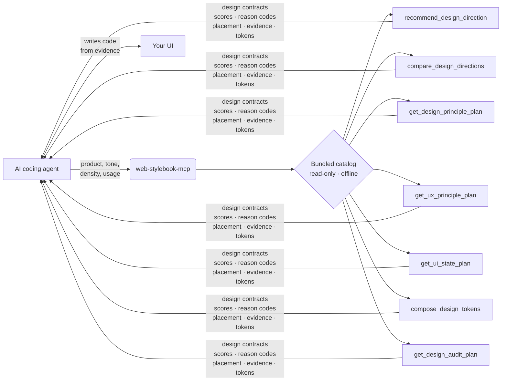

<div align="center">

# web-stylebook-mcp

**Design intelligence for AI coding agents.** Stop shipping the same hero-plus-three-cards.
Your agent gets scored design *contracts* — directions, visual-design plans, UX-principle plans, UI-state plans, tokens, evidence-backed audit plans — then writes and verifies the code from evidence.

[](https://www.npmjs.com/package/web-stylebook-mcp)
[](https://www.npmjs.com/package/web-stylebook-mcp)
[](./LICENSE)
[](https://nodejs.org)
[](https://modelcontextprotocol.io)

**English** · [한국어](./README.ko.md)

</div>

---

Coding agents default to the same generic UI because they can't *decide* what it should look like — so they fall back to hero + 3 cards + a gradient. `web-stylebook-mcp` is a Model Context Protocol server that hands the agent **design contracts** — scored visual directions, placement-aware visual-design plans, evidence-labeled UX-principle plans, UI-state plans, and design tokens — drawn from the same curated catalog as [webstylebook.com](https://webstylebook.com). It returns **evidence, not code**. Your agent still writes the code — now it knows what to build and what to verify.

No API key. No model call. No network. No project filesystem access. **Deterministic, read-only, fully local.**

## Without it / with it

| | Without `web-stylebook-mcp` | With `web-stylebook-mcp` |
|---|---|---|
| **Direction** | Guesses one look, commits to it | Scored candidates + reason codes + what it *rejected* and why |
| **Craft** | Principle names dropped into a doc, nothing verified | Placement guidance + an observable check per principle, cautions attached |
| **UX evidence** | "Hick's Law says…" as a conversation-ender | Evidence-labeled prompts (`strong` / `contextual` / `contested`) you can't restate as law |
| **UI states** | Happy path only; empty / error / loading bolted on later | Required / recommended / domain states up front, per surface |
| **Tokens** | Hand-picked hexes, contrast rarely checked | Role-based tokens with WCAG contrast warnings |
| **Audit** | "Looks good" from a summary | Surface-aware checks with stable ids, severity, required evidence, and explicit unverified states |
| **Result** | Generic AI UI | A defensible design contract the agent builds from |

## Watch it decide

> *"High-density monitoring dashboard for SREs, watched all day on call. Calm, technical. Avoid cyberpunk."*

```jsonc
// → recommend_design_direction  (input)
{
  "productDescription": "High-density monitoring dashboard for SREs, watched all day on call",
  "productType": "operational-saas",
  "tone": ["calm", "technical"],
  "density": "high",
  "usageFrequency": "daily",
  "avoid": ["cyberpunk"]
}
```

```jsonc
// ← result
{
  "confidence": "high",
  "candidates": [                      // all tied at 0.91 — ordering is NOT meaningful
    { "styleId": "notion-style",   "score": 0.91 },
    { "styleId": "platform-core",  "score": 0.91 },
    { "styleId": "quiet-utility",  "score": 0.91 },
    { "styleId": "runtime-signal", "score": 0.91 },
    { "styleId": "console-launch", "score": 0.91 }
  ],
  "rejected": [
    { "styleId": "aurora-gradient",  "reasonCodes": ["PRODUCT_NOT_IDEAL", "DAILY_USE_OVERSTIMULATION"] },
    { "styleId": "claymorphism",     "reasonCodes": ["PRODUCT_NOT_IDEAL"] },
    { "styleId": "cyberpunk-glitch", "reasonCodes": ["EXPLICITLY_AVOIDED", "DAILY_USE_OVERSTIMULATION"] }
  ],
  "pairings": [
    {
      "styleId": "macos-liquid-glass",
      "pairWith": "notion-style",
      "role": ["forms", "navigation", "repetitive surfaces"]
    }
  ],
  "guidance": "Treat candidates as scored evidence; choose using product context. candidates[0] is the strongest match, not a mandate. 5 candidates are tied at the top score — the ordering among them is not meaningful; pick using their \"differentiators\" and your product context."
}
```

Notice what it *doesn't* do: it doesn't pretend there's one winner. Five directions tie at 0.91, rejected styles come with reason codes, and pairings are suggestions rather than a mandate. That honesty is the point — the server provides evidence, the agent decides.

Then turn the chosen direction into real tokens:

```jsonc
// → compose_design_tokens(style: "notion-style", format: "css-variables", theme: "light")
// 0 WCAG contrast warnings
:root {
  --color-canvas: #ffffff;
  --color-text:   #37352f;
  --color-accent: #2383e2;
  --color-border: #d3d3d1;
  /* … role-based color, type, spacing, radius, motion, density */
}
```

One request in — and the agent chose a direction, saw what was rejected and why, and got tokens that pass WCAG, without generating a line of code.

## What an agent builds with it

A different brief — *"a marketing landing page for **Throughline**, a B2B SaaS that turns scattered customer feedback (support tickets, sales calls, app reviews, Slack) into one prioritized roadmap."* No layout, no hero, no styling was specified. Following the companion skill, the agent composed the opening **from the product's core idea** instead of reaching for a stock hero: the right half is a bespoke diagram of the product's actual mechanic — feedback sources converging into an auto-ranked roadmap — not a decorative card you could paste onto any other site.

<div align="center">

</div>

<div align="center"><sub>Composed by an AI agent following the companion skill — the prompt described the product and stack, nothing about the layout.</sub></div>

## How it works


```mermaid
flowchart LR
    A[AI coding agent] -->|product, tone,<br/>density, usage| B(web-stylebook-mcp)
    B --> C{Bundled catalog<br/>read-only · offline}
    C --> D[recommend_design_direction]
    C --> E[compare_design_directions]
    C --> F[get_design_principle_plan]
    C --> G[get_ux_principle_plan]
    C --> H[get_ui_state_plan]
    C --> I[compose_design_tokens]
    C --> J[get_design_audit_plan]
    D & E & F & G & H & I & J -->|design contracts<br/>scores · reason codes<br/>placement · evidence · tokens| A
    A -->|writes code<br/>from evidence| Z[Your UI]
```

The agent describes the product; the server scores its curated catalog and returns structured evidence. No code is generated and nothing leaves your machine.

## Install

Requires **Node ≥ 20**.

<details open>
<summary><b>Codex CLI · IDE extension</b></summary>

Use the Codex CLI:

```bash
codex mcp add web-stylebook -- npx -y web-stylebook-mcp@latest
```

Or add it to `~/.codex/config.toml`. You can also use a project-scoped
`.codex/config.toml` in a trusted repository:

```toml
[mcp_servers.web-stylebook]
command = "npx"
args = ["-y", "web-stylebook-mcp@latest"]
```

Restart Codex or open a new session after editing config. In the Codex TUI, run `/mcp`
to confirm the server is active.

</details>

<details>
<summary><b>Claude Code</b></summary>

```bash
claude mcp add web-stylebook -- npx -y web-stylebook-mcp@latest
```

</details>

<details>
<summary><b>Cursor · Windsurf · generic MCP client</b></summary>

Add to your MCP config:

```json
{
  "mcpServers": {
    "web-stylebook": {
      "command": "npx",
      "args": ["-y", "web-stylebook-mcp@latest"]
    }
  }
}
```

</details>

<details>
<summary><b>Claude Desktop</b></summary>

Add the same block to your `claude_desktop_config.json`, then restart:

- **macOS:** `~/Library/Application Support/Claude/claude_desktop_config.json`
- **Windows:** `%APPDATA%\Claude\claude_desktop_config.json`

```json
{
  "mcpServers": {
    "web-stylebook": {
      "command": "npx",
      "args": ["-y", "web-stylebook-mcp@latest"]
    }
  }
}
```

</details>

## Tools

| Tool | What you get | The honest part |
|------|--------------|-----------------|
| **`recommend_design_direction`** | Scored style candidates with reason codes, **rejected** styles with *why*, secondary pairings, confidence | The model makes the final pick — this is the evidence provider |
| **`compare_design_directions`** | 2–4 directions compared across product-fit, repeated-use, density, trust, distinctiveness, accessibility-risk, motion, maintenance | No single winner is declared |
| **`get_design_principle_plan`** | A focused placement, application, and verification plan selected by visual concerns, surface, phase, or principle ids — with source references where available | Craft prompts are testable guidance, not empirical laws or a fixed recipe |
| **`get_ux_principle_plan`** | A focused apply-and-verify plan selected by outcomes, surface, phase, or principle ids — with questions, cautions, confidence, and references | Principles are contextual prompts, not universal laws or a substitute for research |
| **`get_ui_state_plan`** | Required / recommended / domain UI states for a surface (data-table, form, checkout, chat, developer-console) — triggers, must-show, must-not, a11y, motion | Covers the states agents forget: empty, error, loading, edge |
| **`compose_design_tokens`** | Role-based tokens (color, type, spacing, radius, motion, density) as `json` / `css-variables` / `tailwind` / `typescript`, light / dark / both | Emits WCAG contrast warnings instead of hiding them |
| **`get_design_audit_plan`** | Localized, surface-aware checks with stable ids, severity, applicability, required evidence, remediation, selected principle checks, and UI-state coverage | The tool plans the audit but never pretends it inspected your project; missing evidence is `NOT_VERIFIED`, not `PASS` |

**Catalog:** 48 styles · 25 visual design principles · 23 UX principles · 41 structured audit checks · 20 components · 5 surfaces · 57 UI-state recipes · 29 motion profiles · 14 product archetypes.

## Localized output

Every tool takes an optional `locale`. Reason codes, guidance, and labels come back in the requested language:

```text
"en" | "ko" | "ja"     // English · 한국어 · 日本語
```

## Resources

Browse the catalog directly over MCP resources:

```
webstylebook://manifest
webstylebook://styles · /styles/{id}
webstylebook://motion · /motion/{id}
webstylebook://components · /components/{id}
webstylebook://principles · /principles/{id}
webstylebook://design-principles · /design-principles/{id}
webstylebook://states/surfaces · /states/{surface} · /states/{surface}/{state}
webstylebook://products · /products/{id}
webstylebook://policies/anti-patterns · /policies/verification · /policies/audit-checks
```

## Prompts

Ready-made MCP prompts for common workflows:

`design-product` · `design-screen` · `complete-ui-states` · `redesign-with-style` · `audit-design-direction` · `audit-design-principles` · `audit-ux-principles`

## CLI

```bash
web-stylebook-mcp                 # run the server over stdio (default)
web-stylebook-mcp --version
web-stylebook-mcp --catalog-info
web-stylebook-mcp --validate-catalog
```

## Companion skill

A companion skill ships in [`skill/`](./skill) so your agent reaches for these tools at the right moment — and uses the results well (compose, don't recolor; offer multiple candidates; earn trust, don't fake it; land on reusable components):

**Codex**

- Copy or symlink `skill/web-stylebook-design/` into a Codex skill location such as
  `.agents/skills/web-stylebook-design/` in your repo, or `~/.agents/skills/web-stylebook-design/`
  for your user profile.
- If you do not want to install the skill, copy `skill/AGENTS.md` into your project's `AGENTS.md`.

**Claude Code and other agents**

- Point your agent's skills directory at `skill/web-stylebook-design/`, **or**
- Copy `skill/CLAUDE.md` into your project's `CLAUDE.md` or equivalent rules file.

## Privacy & security

| Property | |
|----------|---|
| API key | None |
| Model calls | None |
| Network access | None — works fully offline |
| Project filesystem access | None — the server only reads its bundled catalog snapshot |
| Behavior | Deterministic, read-only |

The server reads from a catalog snapshot bundled in the package. Nothing is sent anywhere; the same inputs always yield the same contracts.

## Catalog source sync

The canonical catalog is authored in the
[`web-stylebook`](https://github.com/seungdori/web-stylebook) repository. After generating its
local MCP handoff snapshot, verify byte-for-byte parity before releasing this package:

```bash
npm run catalog:check-canonical -- /absolute/path/to/web-stylebook/packages/mcp/generated
```

Without an argument, the command uses `WEB_STYLEBOOK_CANONICAL_CATALOG_DIR` or the local sibling
path `../showcase/packages/mcp/generated`. The regular test suite verifies the bundled artifact's
internal hash, enums, counts, and runtime contract; this command is the explicit cross-repository
source check.

## Compatibility

- **Node:** ≥ 20
- **Transport:** stdio (Model Context Protocol)
- **Clients:** Codex CLI / IDE extension, Claude Code, Claude Desktop, Cursor, Windsurf, and any MCP-compatible client

## License

[MIT](./LICENSE) — covers the code **and** the bundled catalog snapshot (free for commercial use).

> The [webstylebook.com](https://webstylebook.com) website is licensed CC BY-NC. The same owner grants an MIT license for the catalog snapshot bundled in this package.
>
> UX-principle entries are independently written application and verification guidance. They
> attribute and link to [Laws of UX](https://lawsofux.com) (CC BY-NC-ND 4.0) and supporting
> references; Laws of UX prose, illustrations, and page layouts are not bundled.
>
> Visual-design-principle entries form an independently authored, task-oriented review system for
> contemporary interfaces. They cover semantic structure, responsive reflow, localization, tokens
> and themes, multiple input modes, complete state models, recovery, and motion preferences.
